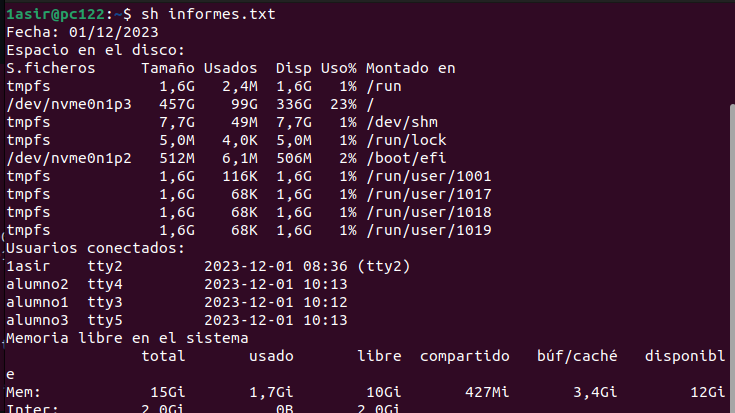
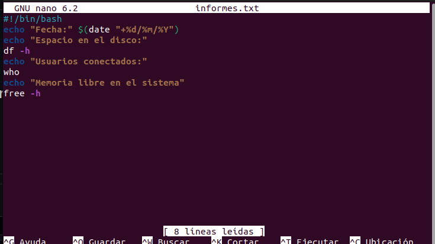

# Redireccionamiento

*Enunciado:* 
**Genera un archivo llamado informe.txt que contenga la siguiente información:**

* La fecha del sistema formateada

* El espacio en disco (df -h)

* La memoria libre del sistema (free -h)

* Usuarios conectados

Terminal:

Imagen del Script ejecutado con exito:

